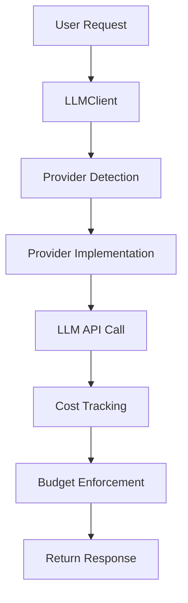

# **StratumAI — Unified Intelligence Across Every Model Layer**

**Status:** Phase 7.5 Complete  
**Providers:** 9 Fully Integrated  
**Capabilities:** Routing • RAG • Caching • Streaming • CLI • Web UI • Large‑File Processing

StratumAI is a production‑ready Python framework that unifies access to frontier LLM providers through a single, consistent API. It eliminates vendor lock‑in, simplifies multi‑model development, and provides intelligent routing, cost tracking, caching, streaming, and RAG capabilities for enterprise‑grade AI systems.

---

# **1. Why StratumAI Matters**

Modern AI applications require flexibility across providers, models, and capabilities. StratumAI provides:

- A **single interface** for 9+ LLM providers  
- **Automatic routing** to the best model for each task  
- **Cost control** with token tracking and budgets  
- **Resilience** through retries and fallback chains  
- **Advanced workflows** including RAG, extraction, and large‑file handling  

StratumAI is designed for teams that need reliability, performance, and multi‑provider optionality without rewriting code.

---

# **2. Key Skills Demonstrated**

- **API Abstraction & Design Patterns**  
  Strategy pattern, factory pattern, provider abstraction

- **Multi‑Provider Integration**  
  OpenAI, Anthropic, Google, DeepSeek, Groq, Grok, OpenRouter, Ollama, AWS Bedrock

- **Production Engineering**  
  Error handling, retry logic, cost tracking, budget management

- **Python Best Practices**  
  Type hints, dataclasses, abstract base classes, decorators

- **Testing & Quality**  
  Unit tests, integration tests, 80%+ coverage target

- **DevOps & Packaging**  
  PyPI preparation, uv/pip dependency management

---

# **3. Platform Overview**

StratumAI is a multi‑provider LLM abstraction layer that allows developers to switch between AI models without changing their code. It provides:

- Unified interface  
- Intelligent routing  
- Cost tracking  
- Streaming  
- Caching  
- Retry logic  
- Budget enforcement  
- RAG integration  
- Large‑file processing  
- CLI and Web UI  

---

# **4. Core Platform Features**

## **4.1 Unified Interface**
- One API for all providers  
- Zero code changes when switching models  
- Automatic provider detection  

## **4.2 Reliability & Performance**
- Retry logic with exponential backoff  
- Fallback model chains  
- Cost tracking and budget enforcement  
- Streaming support for all providers  

## **4.3 Intelligence Layer**
- Router with cost/quality/latency/hybrid strategies  
- Prompt complexity analysis  
- Capability filtering (vision, tools, reasoning)  
- Model metadata (context window, latency, cost)  

## **4.4 Advanced Capabilities**
- Response caching + provider prompt caching  
- Large‑file chunking and progressive summarization  
- File extraction (CSV, JSON, logs, code)  
- Auto model selection for extraction tasks  
- RAG pipeline with embeddings + ChromaDB  
- Semantic search and citation tracking  

---

# **5. Architecture Overview**

## **5.1 Design Principles**
- Abstraction first  
- Strategy pattern for providers  
- Configuration‑driven model catalogs  
- Extensible metadata and capability matrices  

## **5.2 Core Components**
1. **BaseProvider** — shared interface for all providers  
2. **LLMClient** — unified client with routing and detection  
3. **Router** — intelligent model selection  
4. **CostTracker** — usage and budget management  
5. **Decorators** — caching, logging, retry  
6. **Chunking & Extraction** — large‑file processing  
7. **RAG Engine** — embeddings, vector DB, retrieval  

## **5.3 Request Flow**



---

# **6. Technology Stack**

- **Python 3.10+**
- **OpenAI SDK**, **Anthropic SDK**, **Google Generative AI**
- **boto3** for AWS Bedrock
- **pytest**, **pytest‑cov**, **mypy**, **ruff**, **black**
- **FastAPI** (optional web UI)
- **ChromaDB** for vector storage

---

# **7. Quick Start**

## **7.1 Installation**

```bash
git clone https://github.com/Bytes0211/stratumai.git
cd stratumai
pip install -e .
```

Or with `uv`:

```bash
uv sync
```

## **7.2 Configure API Keys**

```bash
cp .env.example .env
# Add your keys
```

Check configuration:

```bash
stratumai check-keys
```

## **7.3 First Chat**

```bash
stratumai chat -p openai -m gpt-4o-mini -t "Hello!"
```

## **7.4 Python Example**

```python
from stratumai import LLMClient
from stratumai.models import Message

client = LLMClient()

response = client.chat(
    model="gpt-4o-mini",
    messages=[Message(role="user", content="Explain quantum computing")]
)

print(response.content)
print(response.usage.cost_usd)
```

---

# **8. CLI Features**

- Chat (streaming or non‑streaming)  
- Interactive mode with file attachments  
- Routing with cost/quality/latency/hybrid strategies  
- Model and provider listing  
- Cache inspection and clearing  
- File analysis (CSV/JSON/logs/code)  
- Auto model selection for extraction tasks  
- RAG indexing and retrieval  

---

# **9. RAG Features**

- Embeddings (OpenAI)  
- ChromaDB vector storage  
- Document indexing and chunking  
- Semantic search  
- Retrieval‑augmented generation  
- Citation tracking  

---

# **10. Project Structure**

```
stratumai/
├── llm_abstraction/
├── chat/
├── cli/
├── api/
├── examples/
└── docs/
```

---

# **11. Testing**

```bash
pytest
pytest -v
```

---

# **12. Project Status**

**Current Phase:** Phase 7.5 — RAG/Vector DB Integration  
**Progress:** Phases 1–7.5 Complete  

A detailed breakdown of all phases (1–7.5) is included in the full README and project documentation.

---

# **13. License**

Internal project — All rights reserved.

---
