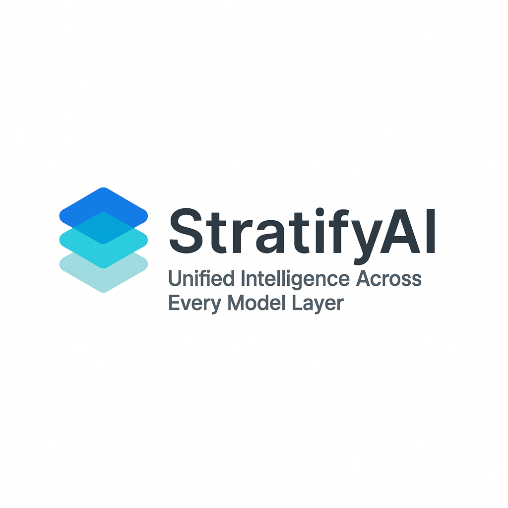

# StratifyAI — Unified Multi‑Provider LLM Interface

   

**Status:** Phase 7.8 Complete  
**Providers:** 9 Operational  
**Features:** Routing • RAG • Caching • Streaming • CLI • Web UI • Builder Pattern

StratifyAI is a production‑ready Python framework that provides a unified interface for 9+ LLM providers, including OpenAI, Anthropic, Google, DeepSeek, Groq, Grok, OpenRouter, Ollama, and AWS Bedrock. It eliminates vendor lock‑in, simplifies multi‑model development, and enables intelligent routing, cost tracking, caching, streaming, and RAG workflows.

---

## Features

### Core

- Unified API for 9+ LLM providers
- Async-first architecture with sync wrappers
- Automatic provider detection
- Cost tracking and budget enforcement
- Latency tracking on all responses
- Retry logic with fallback models
- Streaming support for all providers
- Response caching + provider prompt caching
- Intelligent routing (cost, quality, latency, hybrid)
- Capability filtering (vision, tools, reasoning)
- Model metadata and context window awareness
- **Builder pattern** for fluent configuration

### Advanced

- Large‑file handling with chunking and progressive summarization
- File extraction (CSV schema, JSON schema, logs, code structure)
- Auto model selection for extraction tasks
- RAG pipeline with embeddings + vector DB (ChromaDB)
- Semantic search and citation tracking
- Rich/Typer CLI with interactive mode
- Optional FastAPI web interface

---

## Installation

```bash
git clone https://github.com/Bytes0211/stratifyai.git
cd stratifyai
pip install -e .
```

Or using `uv`:

```bash
uv sync
```

---

## Configuration

```bash
cp .env.example .env
# Add your API keys
```

Check configured providers:

```bash
stratifyai check-keys
```

---

## Quick Start

### CLI Usage

```bash
stratifyai chat -p openai -m gpt-4o-mini -t "Hello"
stratifyai route "Explain relativity" --strategy hybrid
stratifyai interactive
stratifyai cache-stats
```

### Python Example (LLMClient)

```python
from stratifyai import LLMClient
from stratifyai.models import Message, ChatRequest, ChatResponse

client: LLMClient = LLMClient()
request: ChatRequest = ChatRequest(
    model="gpt-4o-mini",
    messages=[Message(role="user", content="Explain quantum computing")]
)

# Async (recommended)
response: ChatResponse = await client.chat_completion(request)

# Sync wrapper for scripts/CLI
response: ChatResponse = client.chat_completion_sync(request)

print(response.content)
print(f"Cost: ${response.usage.cost_usd:.6f}")
print(f"Latency: {response.latency_ms:.0f}ms")
```

### Python Example (Chat Package - Simplified)

```python
from stratifyai.chat import anthropic, openai
from stratifyai.models import ChatResponse

# Quick usage - model is always required
response: ChatResponse = await anthropic.chat("Hello!", model="claude-sonnet-4-5")
print(response.content)

# With options
response: ChatResponse = await openai.chat(
    "Explain quantum computing",
    model="gpt-4o-mini",
    system="Be concise",
    temperature=0.5
)
```

### Builder Pattern (Fluent Configuration)

```python
from stratifyai.chat import anthropic
from stratifyai.chat.builder import ChatBuilder
from stratifyai.models import ChatResponse

# Configure once, use multiple times
client: ChatBuilder = (
    anthropic
    .with_model("claude-sonnet-4-5")
    .with_system("You are a helpful assistant")
    .with_temperature(0.7)
)

# All subsequent calls use the configured settings
response: ChatResponse = await client.chat("Hello!")
response: ChatResponse = await client.chat("Tell me more")

# Stream with builder
async for chunk in client.chat_stream("Write a story"):
    print(chunk.content, end="", flush=True)
```

---

## Routing

- **Cost**: choose cheapest model
- **Quality**: choose highest‑quality model
- **Latency**: choose fastest model
- **Hybrid (default)**: dynamic weighting based on complexity

---

## RAG

- Embeddings (OpenAI)
- ChromaDB vector storage
- Semantic search
- Document indexing
- Retrieval‑augmented generation
- Citation tracking

---

## Project Structure

```
stratifyai/
├── llm_abstraction/      # Core package
│   ├── providers/        # Provider implementations (9 providers)
│   ├── router.py         # Intelligent routing
│   ├── models.py         # Data models
│   └── utils/            # Utilities (token counting, extraction)
├── chat/                 # Simplified chat modules with builder pattern
│   ├── builder.py        # ChatBuilder class
│   └── stratifyai_*.py    # Provider-specific modules
├── cli/                  # Typer CLI
├── api/                  # Optional FastAPI server
├── examples/             # Usage examples
└── docs/                 # Technical documentation
```

---

## Testing

```bash
pytest           # Run all tests
pytest -v        # Verbose output
```

**Test Coverage:** 300+ tests across all modules

---

## License

Internal project — All rights reserved.

