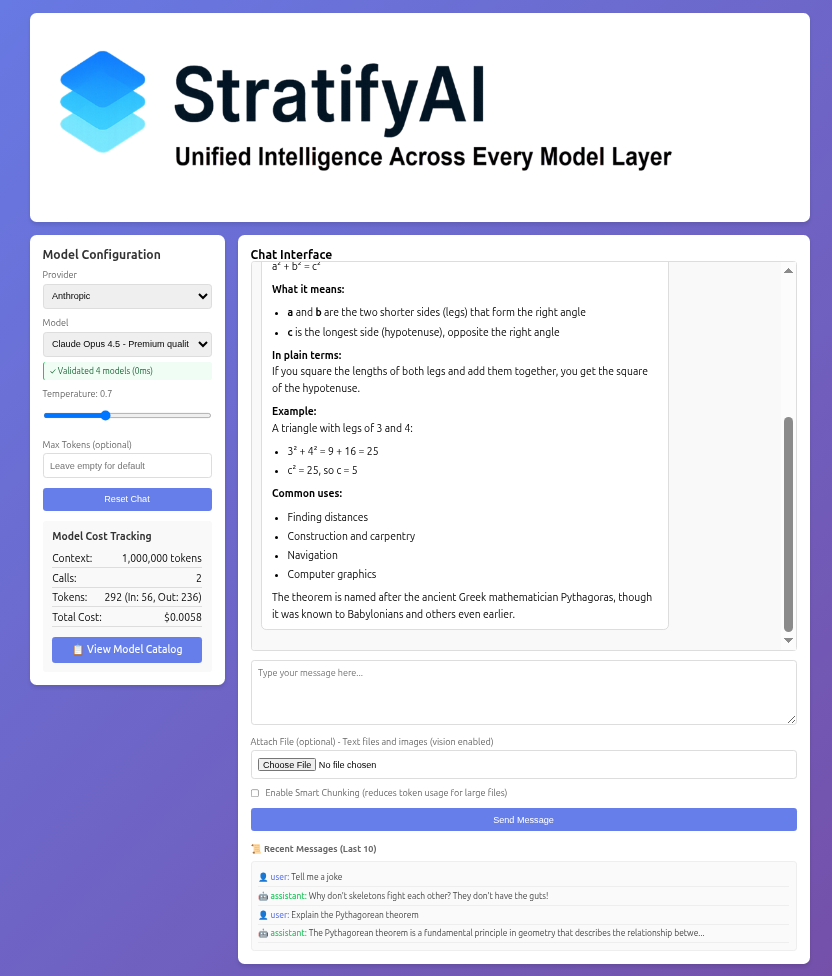
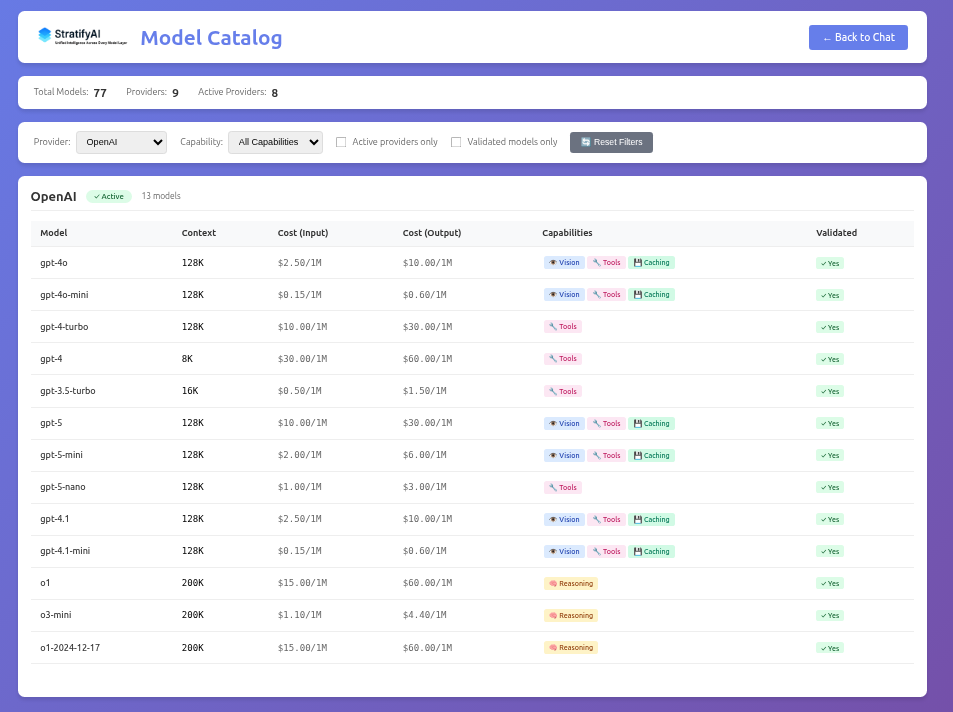
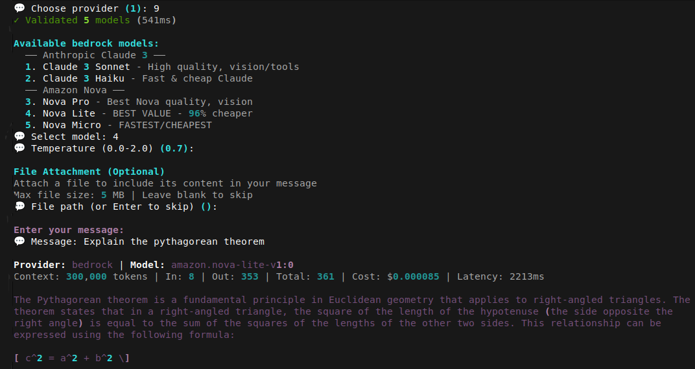

# 📘 StratifyAI UI Overview  

**Unified Intelligence Across Every Model Layer**

This document provides a guided walkthrough of the StratifyAI user interface, including the Web UI, Interactive CLI, Model Catalog, and Large‑File Intelligence features. It complements the main README without embedding images directly into PyPI.

---

# 1. Web UI — Overview

The StratifyAI Web UI provides a clean, modern interface for interacting with any supported LLM provider. It mirrors the capabilities of the CLI and Chat surfaces, ensuring full feature parity.

## 1.1 Header

The top of the interface displays:

- The StratifyAI logo  
- The tagline: **Unified Intelligence Across Every Model Layer**  
- The active provider and model  
- Validation status for available models  

This gives users immediate context about the current configuration.

## 1.2 Model Configuration Panel

Located on the left side of the UI.

### Includes:

- **Provider selector**  
  Choose from OpenAI, Anthropic, Google, Groq, DeepSeek, Grok, OpenRouter, Ollama, and AWS Bedrock.

- **Model selector**  
  Models are grouped by quality tier (e.g., Claude Opus 4.5, GPT‑4o‑mini).

- **Temperature control**  
  Adjustable slider for creativity vs. determinism.

- **Max tokens override**  
  Optional field for output length control.

- **Reset Chat**  
  Clears the conversation and resets state.

- **Model validation status**  
  Shows how many models were successfully validated.

This panel ensures that model configuration is always visible and adjustable without interrupting the conversation.

## 1.3 Model Cost Tracking

A dedicated section tracks usage in real time:

- Total context window  
- Number of calls  
- Token usage (input/output)  
- Total cost  
- Button to open the **Model Catalog**

This makes StratifyAI feel like a professional tool — not a black box.

## 1.4 Chat Interface

The center panel is the main conversation area.

### Features:

- Markdown rendering  
- Syntax highlighting  
- Code blocks  
- Tables  
- Math formulas  
- Streaming responses  
- Automatic scroll‑to‑latest  

The UI is optimized for long‑form reasoning and technical output.

## 1.5 Input Bar

Located at the bottom:

- Message input  
- File upload  
- “Enable Smart Chunking” toggle  
- Send button  
- Recent message history (last 10 messages)

This creates a smooth workflow for both short prompts and large‑file tasks.

---

# 2. Model Catalog

The Model Catalog provides a searchable, filterable view of all available models across all providers.

## 2.1 Columns

- **Model name**  
- **Context window**  
- **Input/output cost per million tokens**  
- **Capabilities**  
  - Vision  
  - Tools  
  - Reasoning  
  - Caching  
- **Validation status**

## 2.2 Filters

- Provider  
- Capability  
- Active providers only  
- Validated models only  

This is one of the strongest parts of StratifyAI — it gives users a clear understanding of cost, capability, and performance tradeoffs.

---

# 3. Interactive CLI

The interactive CLI mirrors the Web UI but in a terminal environment.

### Features:

- Provider and model selection menus  
- Temperature and token controls  
- File loading for context  
- Streaming output  
- Error messages with structured formatting  
- Large‑file detection and chunking  

The CLI is ideal for developers who prefer terminal workflows or need quick testing.

---

# 4. Chat CLI (Large‑File Intelligence)

StratifyAI automatically detects large files and switches into a specialized processing pipeline.

## 4.1 Pipeline

1. **Token‑aware smart chunking**  
2. **Per‑chunk summarization**  
3. **Global synthesis**  
4. **Optional RAG indexing**  
5. **Streaming progress updates**

## 4.2 UI Behavior

- The Web UI shows progress indicators  
- The CLI prints step‑by‑step updates  
- The Chat interface streams chunk summaries  

This makes StratifyAI capable of handling PDFs, logs, codebases, and long documents far beyond typical model limits.

---

# 5. Error Handling

StratifyAI normalizes provider errors into a consistent format.

## 5.1 Error Types

- Authentication errors  
- Rate limits  
- Context window overflow  
- Network issues  
- Routing configuration errors  
- Large‑file processing errors  

## 5.2 UI Presentation

- **Web UI:** toast + expandable details  
- **CLI:** one‑line summary + verbose mode  
- **Chat:** natural‑language summary + technical block  

This makes debugging painless and predictable.

---

# 6. Feature Parity Across Surfaces

StratifyAI ensures that **Web UI**, **Interactive CLI**, and **Chat** all support:

- Routing strategies  
- Model selection  
- Temperature/max token controls  
- File uploads  
- Smart chunking  
- Streaming  
- Error handling  
- Cost tracking  
- Model validation  

This is rare — most frameworks have fragmented UX across surfaces.

---

# 7. Summary

The StratifyAI UI is now:

- Clean  
- Professional  
- Fully featured  
- Consistent across surfaces  
- Optimized for both developers and non‑technical users  

